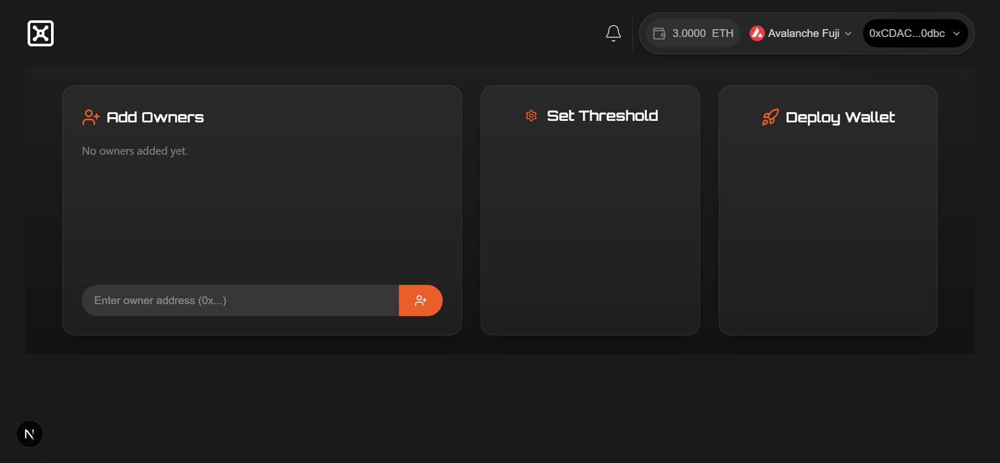
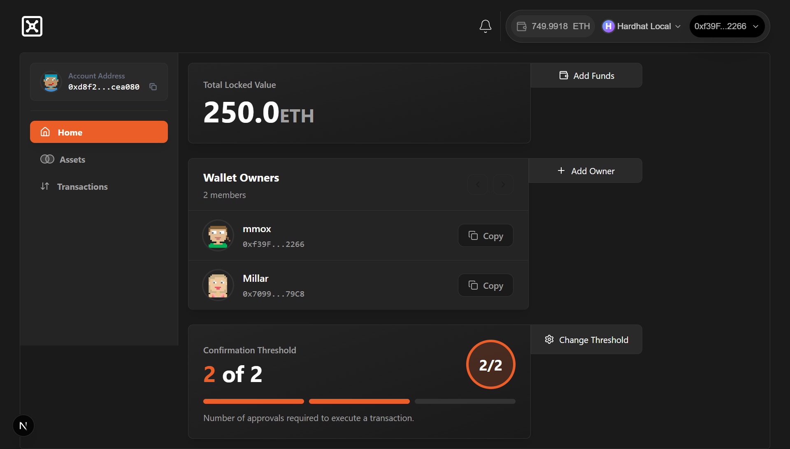
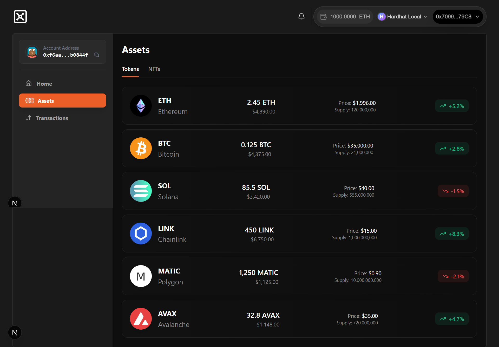
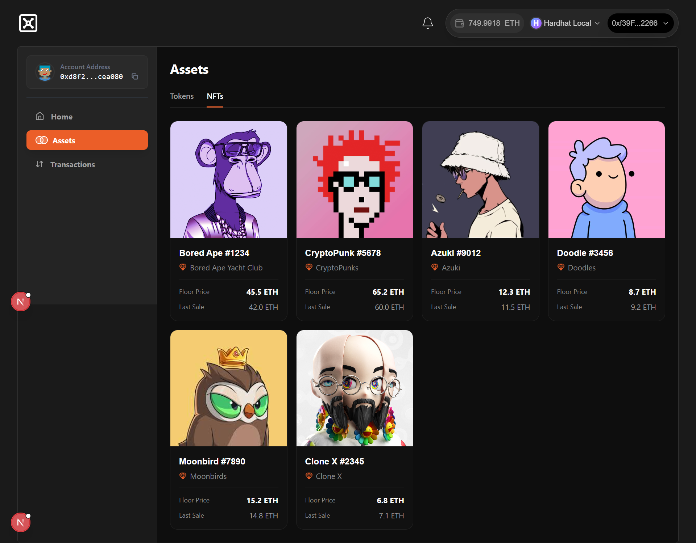
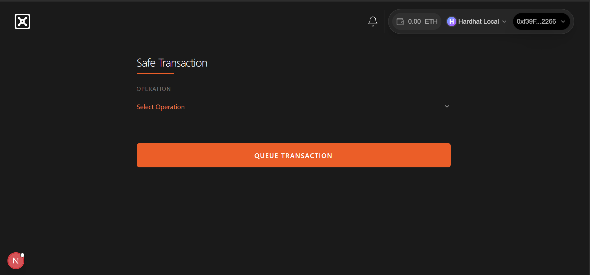
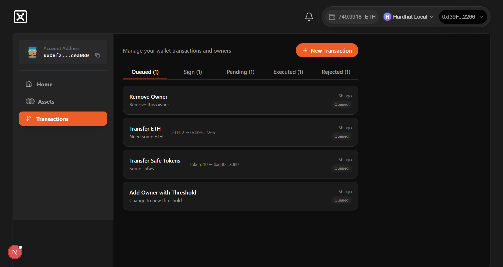
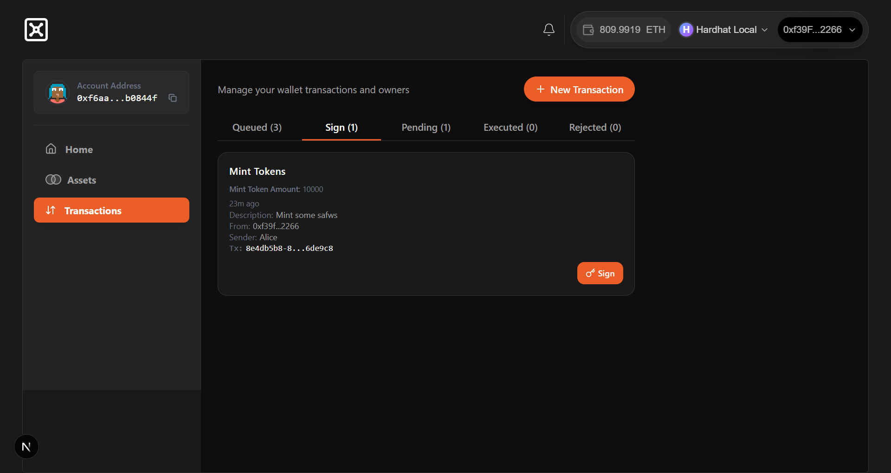
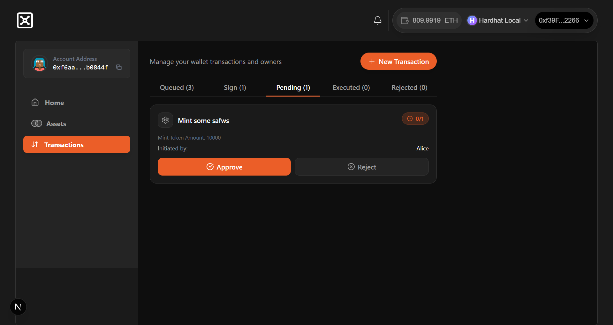
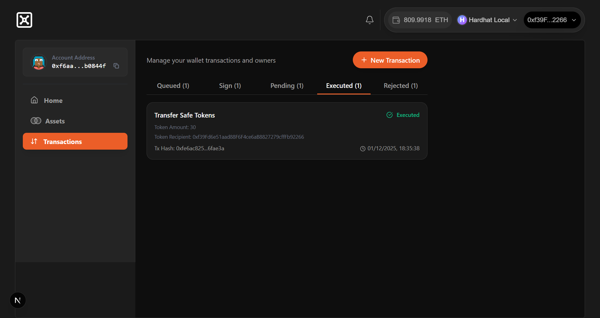
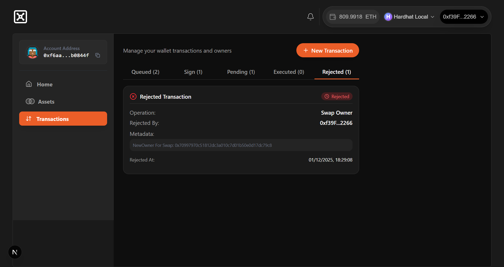

# Multi Signatures Wallet DApp


_Landing section showcasing the DApp._

A **full-stack smart contract wallet** built on the **Gnosis Safe protocol**, enabling users to create and manage **multi-owner wallets** with customizable thresholds for secure transaction execution.

This DApp offers a fully-featured wallet management interface while prioritizing **security, reliability, and user experience**.

---

## Features

- **Transfer ETH** – Send Ether securely from your wallet
- **Transfer Tokens** – Send ERC-20 tokens
- **Add Owner with Threshold** – Add new owners and define approval thresholds
- **Remove Owner** – Remove existing wallet owners
- **Change Threshold** – Update transaction approval thresholds dynamically
- **Set Security Guards** – Apply transaction security measures
- **Mint Tokens** – Mint new ERC-20 tokens
- **Swap Ownership** – Reassign ownership permissions

---

## Security

The smart contracts powering this DApp are **battle-tested** using:

- **Slither** – Static analysis tool for Solidity security
- **Aderyn** – Formal verification tool for smart contracts
- **Manual testing** – Extensive testing to ensure reliability and seamless UX

## Supported Chains

- Sepolia
- Arbitrum
- Arbitrum Sepolia
- Avalanche Fuji
- Optimism
- Optimism Sepolia
- zkSync

## Developed With

- Next.js 16+
- PostgreSQL and Supabase for data storage
- Tailwind CSS
- Shadcn/UI for UI components and toasts
- Reown AppKit for multi-wallet connection
- Ethers.js for blockchain interaction
- Hardhat for smart contract deployment
- Foundry for smart contract testing

## Features

### 1) Hero Section


_Landing section showcasing the DApp._

---

### 2) Create Wallet with Owners & Threshold


_Form to create a wallet with multiple owner addresses and set approval threshold._

---

### 3) Dashboard of Wallet Details


_Overview of wallet details including owners, ETH balance, and tokens._


_Fungible Tokens_

_NFTS_

---

### 4) Add New Transaction


_Interface to propose and submit a new transaction from the wallet._

---

### 5) Transactions Details


_Detailed list of queued transactions executed from the wallet._

_Detailed of transaction to be signed, executed from the wallet._

_Detailed of pending transaction, which is already signed from the wallets._

_Detailed list of executed transaction._

_Detailed list of rejected transactions._

---

## Installation & Usage

```bash
# Clone the repository
git clone https://github.com/AhmadFarazWeb3Developer/Multisig-Wallet.git
cd dapp

# Install dependencies
npm install

# Start the development server
npm run dev
```

Then open your browser at `http://localhost:3000` to interact with the DApp.
